# PromptRules
A rule-based AI animation management system for creating consistent prompts across projects, episodes, scenes, characters, and assets.

## Features

| Feature         | Description                             |
| --------------- | --------------------------------------- |
| 📁 Projects     | Organize multiple AI animation projects |
| 🎬 Episodes     | Manage episodes and scenes              |
| 👥 Characters   | Maintain character consistency          |
| 📦 Assets       | Track reusable objects                  |
| 📜 Prompt Rules | Build reusable prompt components        |
| 🎯 Compiler     | Generate model-specific prompts         |
---

  
## 📁 Project Main
Displays all projects in the system, providing quick access to manage episodes, characters, assets, and prompt rules.
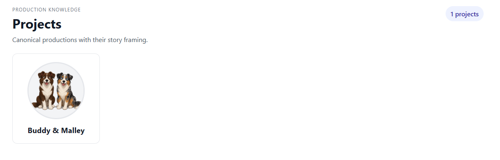

## 📋 Project Detail
Central workspace for managing a project's information, linked resources, and the complete AI animation workflow.
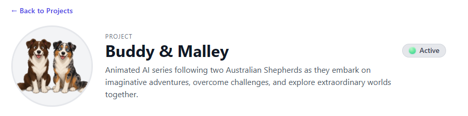

---

  
## 🎬 Episode Main
Displays every episode in the project, providing a high-level view of the production timeline and available content.
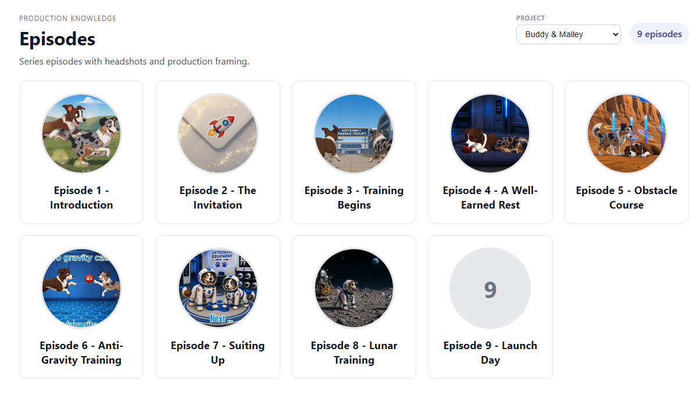

## 🎥 Episode Detail
Organizes an episode's scenes, assets, characters, and prompt rules into a single production workspace.
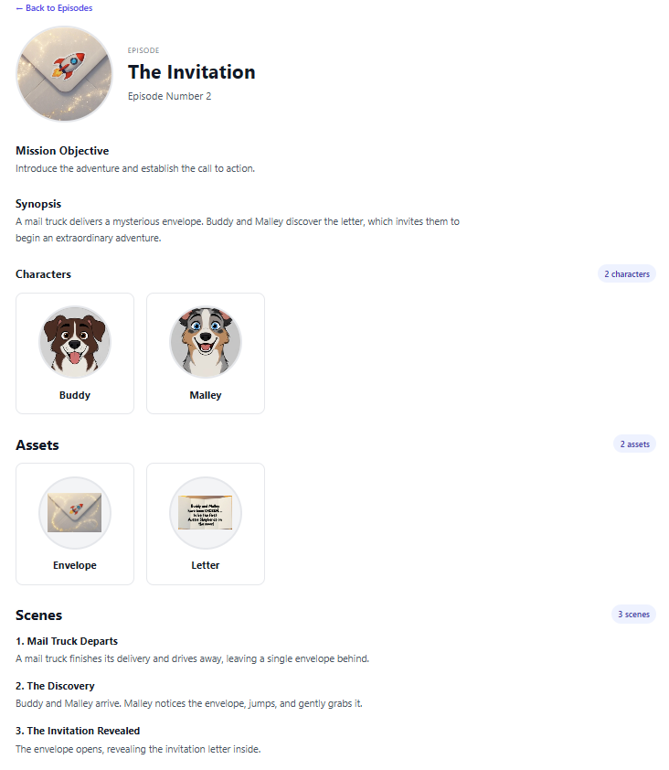

---

  
## 👥 Character Main
Displays every character in the project, making it easy to organize and maintain consistent character references.
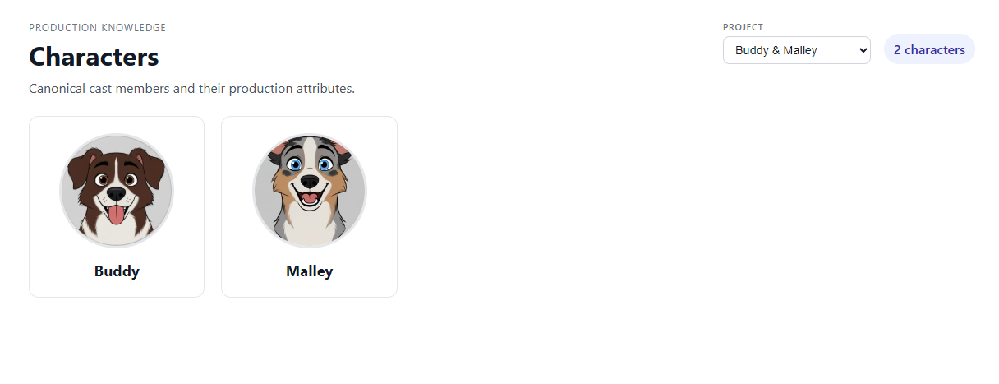

## 🐶 Character Detail
Manages a character's reference images, attributes, and prompt rules to ensure visual consistency across every scene.
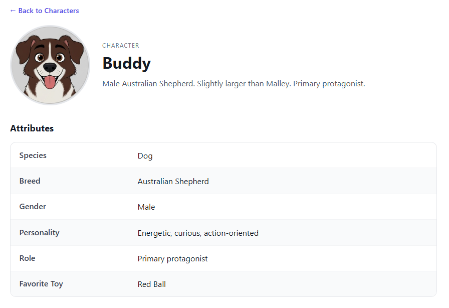

---

  
## 📦 Asset Main
Displays all reusable assets, allowing them to be organized and shared across multiple episodes and scenes.
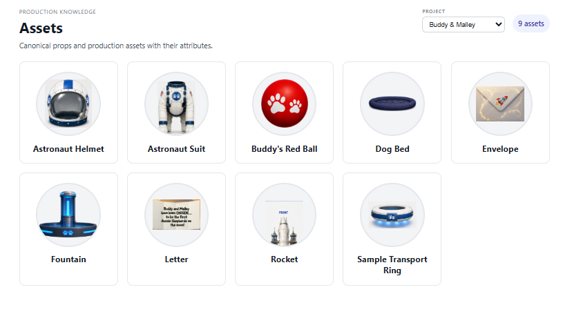

## 🔧 Asset Detail
Maintains each asset's images, properties, and prompt rules while tracking where it is used throughout the project.
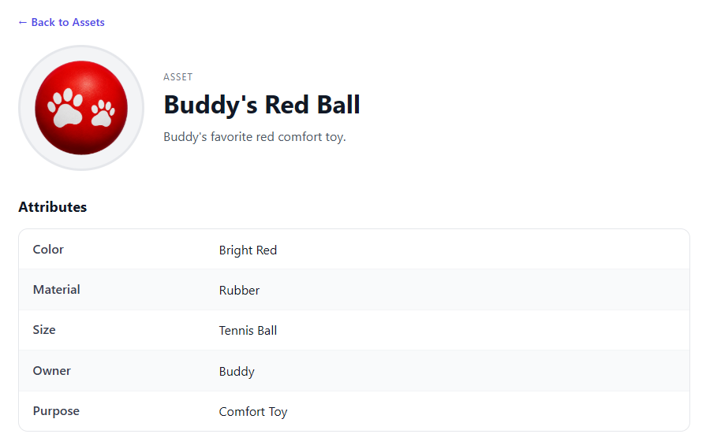

---

  
## 📜 Prompt Rules Main
Organizes reusable prompt rules that serve as the foundation for consistent AI image and video generation.
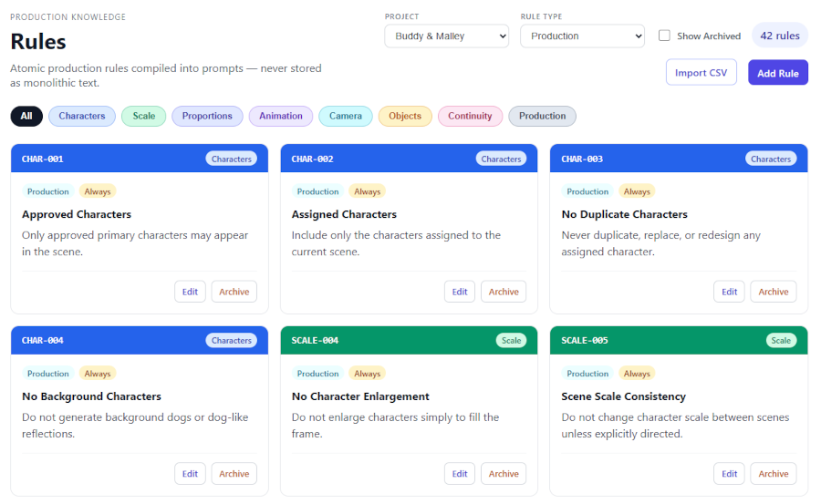

## ⚙️ Prompt Rule Detail
Defines the behavior, metadata, and categorization of each rule used by the Prompt Compiler to generate final AI prompts.
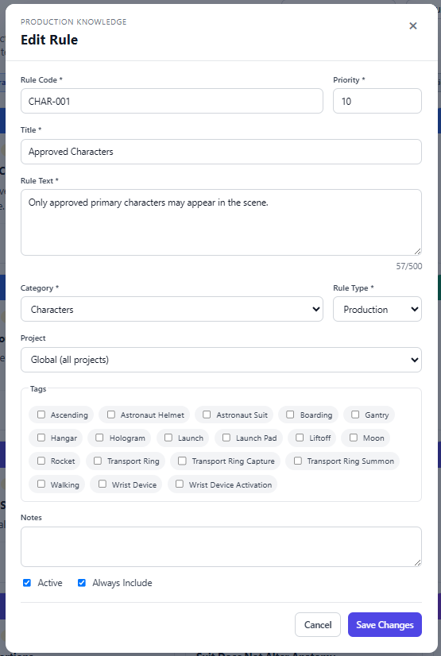

---
  

## 🎯 Prompt Compiler
Generates the final AI prompt by combining project, episode, scene, character, and asset rules into a single output.

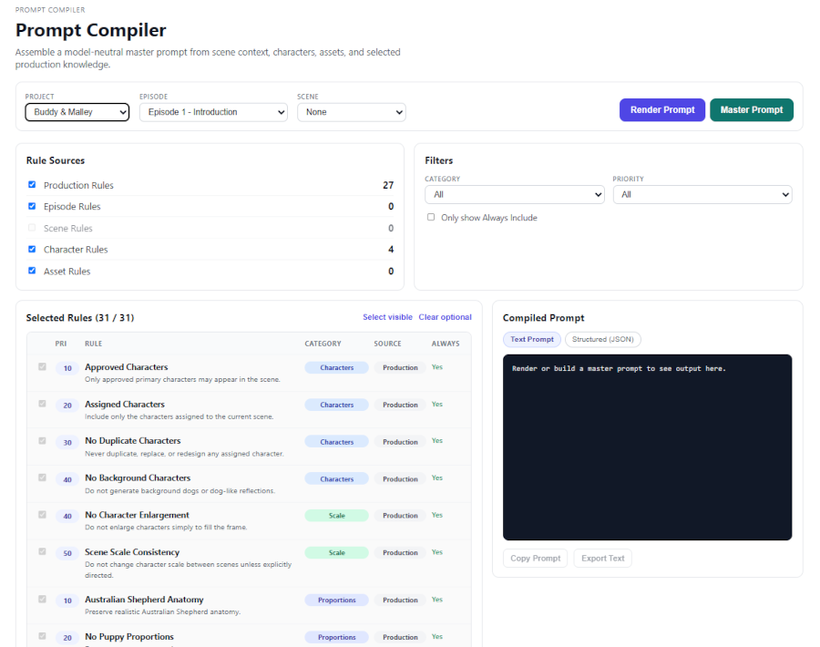

---
  
## 🤖 Built with
- Python
- React
- SQL Server
- Database-driven application architecture
- AI prompt management and rule compilation
